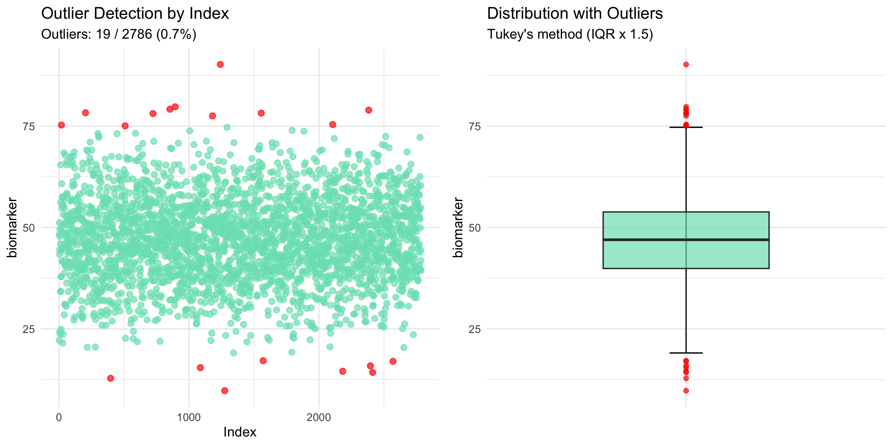
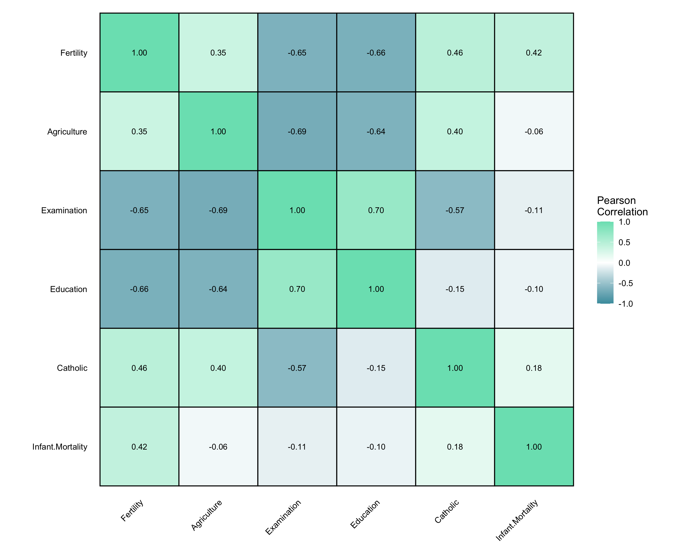
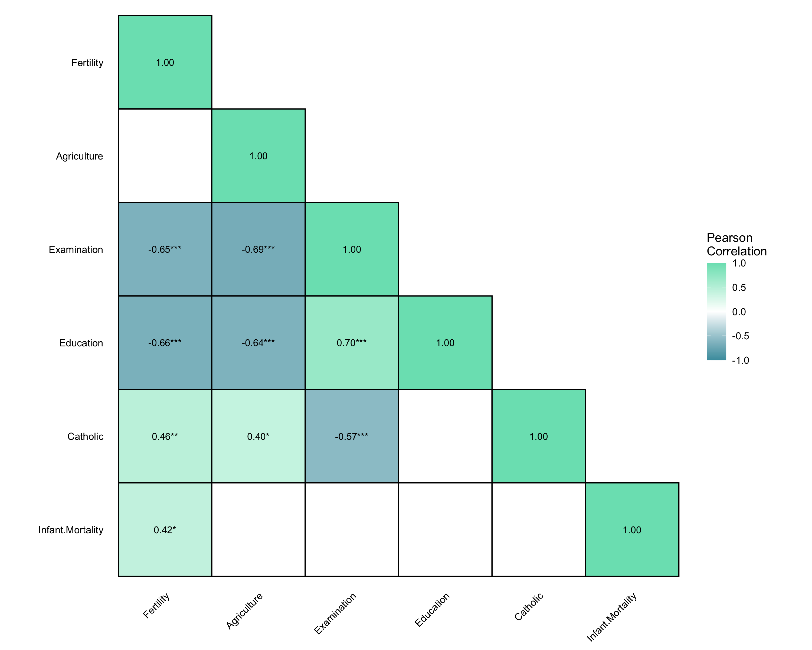
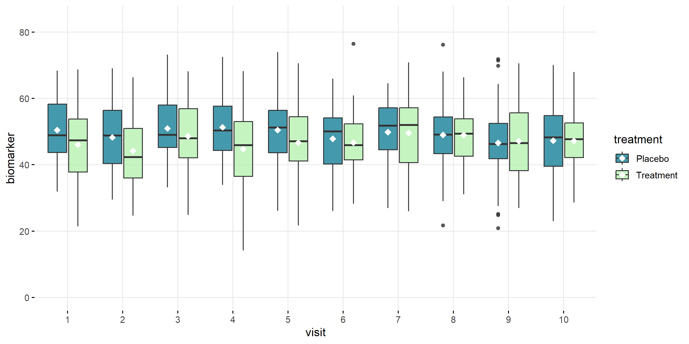
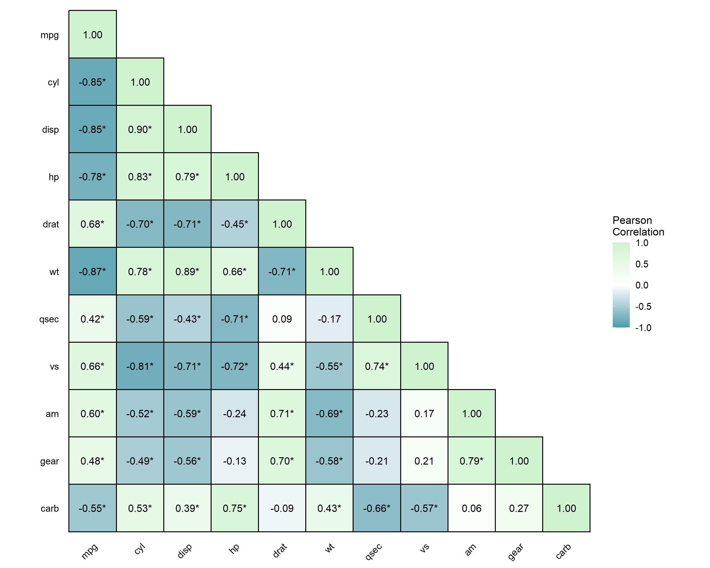

<!-- README.md is generated from README.Rmd. Please edit that file -->

# biostats <a href="https://github.com/sebasquirarte/biostats/blob/main/man/figures/logo.png"></a>

<!-- badges: start -->


[](https://github.com/sebasquirarte/biostats/actions/workflows/R-CMD-check.yml)
[](https://app.codecov.io/gh/sebasquirarte/biostats)
[](https://cranlogs.r-pkg.org/)
<!-- badges: end -->

## Overview

***biostats*** is an R package that functions as a toolbox to aid in
biostatistics and clinical data analysis tasks and workflows.

#### Key features

- Descriptive statistics and exploratory data analysis
- Sample size and power calculation
- Statistical analysis and inference
- Data visualization

Designed primarily for comparative clinical studies, trial planning, and
analysis, this package serves both as an analytical toolkit for
professional biostatisticians and clinical data analysts and as an
educational resource for researchers transitioning to R-based
biostatistics, including professionals from other domains, clinical
research professionals, and medical practitioners involved in the
development of clinical trials.

*Developed by the biostatistics team at [Laboratorios Sophia S.A. de
C.V.](https://sophialab.com/en/)*

## Installation

``` r
# Install latest CRAN release:
install.packages("biostats") 

# Or install developer version from GitHub:
#install.packages("pak")
pak::pak("sebasquirarte/biostats")
```

## Usage

``` r
library(biostats)
```

This package comprises 14 functions across four analytical domains:

- [**Descriptive Statistics and Exploratory Data Analysis
  (EDA)**](#descriptive-statistics-and-exploratory-data-analysis-eda)
  - [clinical_data()](#clinical_data)
  - [summary_table()](#summary_table)
  - [normality()](#normality)
  - [missing_values()](#missing_values)
  - [outliers()](#outliers)
- [**Sample Size and Power
  Calculation**](#sample-size-and-power-calculation)
  - [sample_size()](#sample_size)
  - [sample_size_range()](#sample_size_range)
- [**Statistical Analysis and
  Inference**](#statistical-analysis-and-inference)
  - [omnibus()](#omnibus)
  - [effect_measures()](#effect_measures)
- [**Data Visualization**](#data-visualization)
  - [plot_bar()](#plot_bar)
  - [plot_line()](#plot_line)
  - [plot_hist()](#plot_hist)
  - [plot_box()](#plot_box)
  - [plot_corr()](#plot_corr)

### Descriptive Statistics and Exploratory Data Analysis (EDA)

#### **clinical_data()**

##### Description

Creates a simple simulated clinical trial dataset with subject
demographics, multiple visits, treatment groups with different effects,
numerical and categorical variables, as well as optional missing data
and dropout rates.

##### Parameters

| Parameter | Description | Default |
|----|----|----|
| `n` | Integer indicating the number (1-999) of subjects. | `100` |
| `visits` | Integer indicating the number of visits including baseline. | `3` |
| `arms` | Character vector of treatment arm names. | `c("Placebo", "Treatment")` |
| `dropout` | Numeric parameter indicating the proportion (0-1) of subjects who dropout. | `0` |
| `missing` | Numeric parameter indicating the proportion (0-1) of missing values to be introduced across numeric variables with fixed proportions (biomarker = 15%, weight = 25%, response = 60%). | `0` |

##### Examples

``` r
# Simulate basic clinical data
clinical_df <- clinical_data()

str(clinical_df)
#> 'data.frame':    300 obs. of  8 variables:
#>  $ participant_id: chr  "001" "001" "001" "002" ...
#>  $ visit         : Factor w/ 3 levels "1","2","3": 1 2 3 1 2 3 1 2 3 1 ...
#>  $ sex           : Factor w/ 2 levels "Male","Female": 1 1 1 1 1 1 1 1 1 1 ...
#>  $ treatment     : Factor w/ 2 levels "Placebo","Treatment": 2 2 2 1 1 1 1 1 1 1 ...
#>  $ age           : num  35 35 35 21 21 21 47 47 47 35 ...
#>  $ weight        : num  55.4 60.3 58.1 68.3 66.3 64 76 77.6 74.9 61.7 ...
#>  $ biomarker     : num  42.2 44.7 44.9 56.5 51 ...
#>  $ response      : Factor w/ 3 levels "Complete","Partial",..: 1 3 2 3 3 3 3 2 3 3 ...

head(clinical_df, 10)
#>    participant_id visit  sex treatment age weight biomarker response
#> 1             001     1 Male Treatment  35   55.4     42.22 Complete
#> 2             001     2 Male Treatment  35   60.3     44.70     None
#> 3             001     3 Male Treatment  35   58.1     44.85  Partial
#> 4             002     1 Male   Placebo  21   68.3     56.51     None
#> 5             002     2 Male   Placebo  21   66.3     51.03     None
#> 6             002     3 Male   Placebo  21   64.0     39.59     None
#> 7             003     1 Male   Placebo  47   76.0     24.92     None
#> 8             003     2 Male   Placebo  47   77.6     49.99  Partial
#> 9             003     3 Male   Placebo  47   74.9     60.69     None
#> 10            004     1 Male   Placebo  35   61.7     50.58     None
```

``` r
# Simulate more complex clinical data
clinical_df_full <- clinical_data(n = 300,
                                  visits = 10,
                                  arms = c('A', 'B', 'C'), 
                                  dropout = 0.10,
                                  missing = 0.05)

str(clinical_df_full)
#> 'data.frame':    3000 obs. of  8 variables:
#>  $ participant_id: chr  "001" "001" "001" "001" ...
#>  $ visit         : Factor w/ 10 levels "1","2","3","4",..: 1 2 3 4 5 6 7 8 9 10 ...
#>  $ sex           : Factor w/ 2 levels "Male","Female": 1 1 1 1 1 1 1 1 1 1 ...
#>  $ treatment     : Factor w/ 3 levels "A","B","C": 3 3 3 3 3 3 3 3 3 3 ...
#>  $ age           : num  25 25 25 25 25 25 25 25 25 25 ...
#>  $ weight        : num  64.7 65.1 64.2 62.3 62.1 NA NA 61.8 63.7 64.1 ...
#>  $ biomarker     : num  48.2 22.2 51.2 43.4 44.5 ...
#>  $ response      : Factor w/ 3 levels "Complete","Partial",..: 1 1 3 1 3 1 3 3 NA 1 ...

head(clinical_df_full, 20)
#>    participant_id visit    sex treatment age weight biomarker response
#> 1             001     1   Male         C  25   64.7     48.24 Complete
#> 2             001     2   Male         C  25   65.1     22.17 Complete
#> 3             001     3   Male         C  25   64.2     51.21     None
#> 4             001     4   Male         C  25   62.3     43.38 Complete
#> 5             001     5   Male         C  25   62.1     44.52     None
#> 6             001     6   Male         C  25     NA     24.25 Complete
#> 7             001     7   Male         C  25     NA     49.55     None
#> 8             001     8   Male         C  25   61.8     47.78     None
#> 9             001     9   Male         C  25   63.7     23.65     <NA>
#> 10            001    10   Male         C  25   64.1     45.97 Complete
#> 11            002     1 Female         B  72   71.1     34.18     None
#> 12            002     2 Female         B  72   70.7     65.47     None
#> 13            002     3 Female         B  72   71.2     34.29     None
#> 14            002     4 Female         B  72     NA        NA     <NA>
#> 15            002     5 Female         B  72     NA        NA     <NA>
#> 16            002     6 Female         B  72     NA        NA     <NA>
#> 17            002     7 Female         B  72     NA        NA     <NA>
#> 18            002     8 Female         B  72     NA        NA     <NA>
#> 19            002     9 Female         B  72     NA        NA     <NA>
#> 20            002    10 Female         B  72     NA        NA     <NA>
```

#### **summary_table()**

##### Description

Generates a summary table for biostatistics and clinical data analysis
with automatic normality, effect size, and statistical test
calculations. Handles both numeric and categorical variables, performing
appropriate descriptive statistics and inferential tests for
single-group summaries or two-group comparisons.

##### Parameters

| Parameter | Description | Default |
|----|----|----|
| `data` | Dataframe containing the variables to be summarized. | `Required` |
| `group_by` | Character string indicating the name of the grouping variable for two-group comparisons. | `NULL` |
| `normality_test` | Character string indicating the normality test to use: ‘S-W’ for Shapiro-Wilk or ‘K-S’ for Kolmogorov-Smirnov with Lilliefors’ correction. | `'S-W'` |
| `all` | Logical parameter that shows all calculated statistics. | `FALSE` |
| `effect_size` | Logical parameter that includes effect size estimates. | `FALSE` |
| `exclude` | Character vector of variable names to exclude from the summary. | `NULL` |

##### Examples

``` r
# Overall summary without considering treatment groups
summary_table(clinical_df, exclude = c('participant_id', 'visit'))
```


``` r
# Grouped summary by treatment group
summary_table(clinical_df, group_by = 'treatment', exclude = c('participant_id', 'visit'))
```


``` r
# Grouped summary by treatment group with all stats and effect size
summary_table(clinical_df,
              group_by = 'treatment',
              all = TRUE,
              effect_size = TRUE,
              exclude = c('participant_id', 'visit'))
```


#### **normality()**

##### Description

Tests normality using sample size-appropriate methods: Shapiro-Wilk test
(n less than or equal to 50) or Kolmogorov-Smirnov test with Lilliefors’
correction (n greater than 50) with Q-Q plots and histograms. Evaluates
skewness and kurtosis using z-score criteria based on sample size.
Automatically detects outliers and provides comprehensive visual and
statistical assessment.

##### Parameters

| Parameter | Description | Default |
|----|----|----|
| `data` | Dataframe containing the variables to be summarized. | `Required` |
| `x` | Character string indicating the variable to be analyzed. | `Required` |
| `all` | Logical parameter that displays all row indices of values outside 95% CI. | `FALSE` |
| `color` | Character string indicating color for plots. | `"#79E1BE"` |

##### Examples

``` r
# Filter clinical data to Placebo arm
clinical_df_treat <- clinical_df[clinical_df$treatment == "Placebo", ]

# Normally distributed variable
normality(data = clinical_df_treat, "biomarker")
#> 
#> Normality Test for 'biomarker' 
#> 
#> n = 159 
#> mean (SD) = 49.44 (9.2) 
#> median (IQR) = 50.38 (13.1) 
#> 
#> Kolmogorov-Smirnov (Lilliefors): D = 0.054, p = 0.305 
#> Shapiro-Wilk: W = 0.992, p = 0.546 
#> Skewness: 0.06 (z = 0.30) 
#> Kurtosis: -0.03 (z = -0.08) 
#> 
#> Data appears normally distributed.
#> 
```


``` r

# Non-normally distributed variable with points outside 95% CI displayed
normality(data = clinical_df_treat, "weight", all = TRUE)
#> 
#> Normality Test for 'weight' 
#> 
#> n = 159 
#> mean (SD) = 72.56 (12.9) 
#> median (IQR) = 69.20 (21.1) 
#> 
#> Kolmogorov-Smirnov (Lilliefors): D = 0.125, p < 0.001 
#> Shapiro-Wilk: W = 0.951, p < 0.001 
#> Skewness: 0.28 (z = 1.45) 
#> Kurtosis: -1.09 (z = -2.85) 
#> 
#> Data appears not normally distributed.
#>  
#> VALUES OUTSIDE 95% CI (row indices): 40, 41, 47, 22, 3, 16, 71, 105, 125, 72, 90, 89, 129, 34, 93, 103, 69, 65, 59, 2, 66, 109, 114, 107, 110, 95, 111, 58, 70, 1, 106, 113, 152, 32, 112, 115, 57, 20, 84, 29, 142, 21, 55, 102, 143, 56, 86, 144, 83
```


#### **missing_values()**

##### Description

Provides descriptive statistics and visualizations of missing values in
a dataframe.

##### Parameters

| Parameter | Description | Default |
|----|----|----|
| `data` | Dataframe containing the variables to be analyzed. | `Required` |
| `color` | Character string indicating the color for missing values. | `"#79E1BE"` |
| `all` | Logical parameter that shows all variables including those without missing values. | `FALSE` |

##### Examples

``` r
# Missing value analysis of only variables with missing values
missing_values(clinical_df_full)
#> 
#> Missing Value Analysis
#> 
#> Complete rows: 2452 (81.7%)
#> Missing cells: 868 (3.6%)
#> 
#>           n_missing pct_missing
#> response        403       13.43
#> weight          251        8.37
#> biomarker       214        7.13
```


``` r

# Show all variables including those without missing values
missing_values(clinical_df_full, all = TRUE)
#> 
#> Missing Value Analysis
#> 
#> Complete rows: 2452 (81.7%)
#> Missing cells: 868 (3.6%)
#> 
#>                n_missing pct_missing
#> response             403       13.43
#> weight               251        8.37
#> biomarker            214        7.13
#> participant_id         0        0.00
#> visit                  0        0.00
#> sex                    0        0.00
#> treatment              0        0.00
#> age                    0        0.00
```


#### **outliers()**

##### Description

Identifies outliers using Tukey’s interquartile range (IQR) method and
provides descriptive statistics and visualizations for outlier
assessment in numeric data.

##### Parameters

| Parameter | Description | Default |
|----|----|----|
| `data` | Dataframe containing the variables to be analyzed. | `Required` |
| `x` | Character string indicating the variable to be analyzed. | `Required` |
| `threshold` | Numeric value multiplying the IQR to define outlier boundaries. | `1.5` |
| `color` | Character string indicating the color for non-outlier data points. | `"#79E1BE"` |

##### Examples

``` r
# Basic outlier detection
outliers(clinical_df_full, "biomarker")
#> 
#> Outlier Analysis
#> 
#> Variable: 'biomarker'
#> n: 2786
#> Missing: 214 (7.1%)
#> Method: Tukey's IQR x 1.5
#> Bounds: [18.971, 74.761]
#> Outliers detected: 19 (0.7%)
#> 
#> Outlier indices: 27, 223, 440, 559, 795, 931, 973, 1175, 1277, 1346, 1381, 1680, 1706, 2288, 2370, 2571, 2584, 2602, 2764
```



``` r

# Using custom threshold
outliers(clinical_df_full, "biomarker", threshold = 1.0)
#> 
#> Outlier Analysis
#> 
#> Variable: 'biomarker'
#> n: 2786
#> Missing: 214 (7.1%)
#> Method: Tukey's IQR x 1.0
#> Bounds: [25.945, 67.788]
#> Outliers detected: 115 (4.1%)
#> 
#> Outlier indices: 2, 6, 9, 24, 27, 38, 42, 47, 56, 130 (...)
```


### Sample Size and Power Calculation

#### **sample_size()**

##### Description

Calculates the sample size needed in a clinical trial based on study
design and statistical parameters using standard formulas for hypothesis
testing (Chow, S. 2017).

##### Parameters

| Parameter | Description | Default |
|----|----|----|
| `sample` | Character string indicating whether one or two samples need to be calculated. Options: `"one-sample"` or `"two-sample"`. | `Required` |
| `design` | Character string indicating study design when `sample = "two-sample"`. Options: `"parallel"` or `"crossover"`. | `NULL` (for one-sample tests) |
| `outcome` | Character string indicating the type of outcome variable. Options: `"mean"` or `"proportion"`. | `Required` |
| `type` | Character string indicating the type of hypothesis test. Options: `"equality"`, `"equivalence"`, `"non-inferiority"`, or `"superiority"`. | `Required` |
| `alpha` | Numeric parameter indicating the Type I error rate (significance level). | `0.05` |
| `beta` | Numeric parameter indicating the Type II error rate (1 - power). | `0.20` |
| `x1` | Numeric value of the mean or proportion for group 1 (treatment group). | `Required` |
| `x2` | Numeric value of the mean or proportion for group 2 (control group or reference value). | `Required` |
| `SD` | Numeric value indicating the standard deviation. Required for mean outcomes and crossover designs with proportion outcomes. | `NULL` |
| `delta` | Numeric value indicating the margin of clinical interest. Required for non-equality tests. Must be negative for non-inferiority and positive for superiority/equivalence. | `NULL` |
| `dropout` | Numeric value indicating the discontinuation rate expected in the study. Must be between 0 and 1. | `0` |
| `k` | Numeric value indicating the allocation ratio (`n1/n2`) for two-sample tests. | `1` |

##### Examples

``` r
# Two-sample parallel non-inferiority test for means with 10% expected dropout
sample_size(sample = 'two-sample', design = 'parallel', outcome = 'mean',
            type = 'non-inferiority', x1 = 5.0, x2 = 5.0, 
            SD = 0.1, delta = -0.05, k = 1, dropout = 0.1)
#> 
#> Sample Size Calculation
#> 
#> Test type: non-inferiority
#> Design: parallel, two-sample
#> Outcome: mean
#> Alpha (α): 0.050
#> Beta (β): 0.200
#> Power: 80.0%
#> 
#> Parameters:
#> x1 (treatment): 5.000
#> x2 (control/reference): 5.000
#> Difference (x1 - x2): 0.000
#> Standard Deviation (σ): 0.100
#> Allocation Ratio (k): 1.00
#> Delta (δ): -0.050
#> Dropout rate: 10.0%
#> 
#> Required Sample Size
#> n1 = 55
#> n2 = 55
#> Total = 110
#> 
#> Note: Sample size increased by 10.0% to account for potential dropouts.
```

``` r
# One-sample equivalence test for means
sample_size(sample = "one-sample", outcome = "mean", type = "equivalence",
            x1 = 0, x2 = 0, SD = 0.1, delta = 0.05)
#> 
#> Sample Size Calculation
#> 
#> Test type: equivalence
#> Design: one-sample
#> Outcome: mean
#> Alpha (α): 0.050
#> Beta (β): 0.200
#> Power: 80.0%
#> 
#> Parameters:
#> x1 (treatment): 0.000
#> x2 (control/reference): 0.000
#> Difference (x1 - x2): 0.000
#> Standard Deviation (σ): 0.100
#> Delta (δ): 0.050
#> 
#> Required Sample Size
#> n = 35
#> Total = 35
```

#### **sample_size_range()**

##### Description

Calculates required sample sizes for specified power levels (70%, 80%,
90%) across a range of treatment effect values (*x1*), while keeping the
control group value (*x2*) fixed. Internally calls *sample_size()* and
generates a plot to visualize how total sample size changes with varying
*x1*.

##### Parameters

| Parameter | Description | Default |
|----|----|----|
| `x1_range` | Numeric vector of length 2 specifying the range of values to evaluate for the treatment group mean or proportion (`x1`). | `Required` |
| `x2` | Numeric value for the control group mean or proportion (reference value). | `Required` |
| `step` | Numeric value indicating the step size to increment across the `x1_range`. | `0.1` |
| `...` | Additional arguments passed to `sample_size()`, such as `sample`, `design`, `outcome`, `type`, `SD`, `alpha`, etc. | `Required` |

##### Examples

``` r
# Two-sample parallel non-inferiority test for proportions with 10% dropout
result <- sample_size_range(x1_range = c(0.65, 0.75), x2 = 0.65, step = 0.01,
                            sample = "two-sample", design = "parallel", outcome = "proportion",
                            type = "non-inferiority", delta = -0.1, dropout = 0.1)

print(result)
#> 
#> Sample Size Range Analysis
#> 
#> Treatment range (x1): 0.650 to 0.660
#> Control/Reference (x2): 0.650
#> Step size: 0.010
#> 
#> 70% Power: Total n = 108 to 474
#> 80% Power: Total n = 144 to 622
#> 90% Power: Total n = 196 to 858
#> 
#> Sample size increased by 10.0% to account for potential dropouts.
```


``` r
result$data
```

| power |   x1 |   x2 | diff |  n1 |  n2 | total_n |
|------:|-----:|-----:|-----:|----:|----:|--------:|
|    70 | 0.65 | 0.65 | 0.00 | 237 | 237 |     474 |
|    70 | 0.66 | 0.65 | 0.01 | 194 | 194 |     388 |
|    70 | 0.67 | 0.65 | 0.02 | 162 | 162 |     324 |
|    70 | 0.68 | 0.65 | 0.03 | 137 | 137 |     274 |
|    70 | 0.69 | 0.65 | 0.04 | 117 | 117 |     234 |
|    70 | 0.70 | 0.65 | 0.05 | 102 | 102 |     204 |
|    70 | 0.71 | 0.65 | 0.06 |  88 |  88 |     176 |
|    70 | 0.72 | 0.65 | 0.07 |  77 |  77 |     154 |
|    70 | 0.73 | 0.65 | 0.08 |  69 |  69 |     138 |
|    70 | 0.74 | 0.65 | 0.09 |  61 |  61 |     122 |
|    70 | 0.75 | 0.65 | 0.10 |  54 |  54 |     108 |
|    80 | 0.65 | 0.65 | 0.00 | 311 | 311 |     622 |
|    80 | 0.66 | 0.65 | 0.01 | 255 | 255 |     510 |
|    80 | 0.67 | 0.65 | 0.02 | 213 | 213 |     426 |
|    80 | 0.68 | 0.65 | 0.03 | 180 | 180 |     360 |
|    80 | 0.69 | 0.65 | 0.04 | 154 | 154 |     308 |
|    80 | 0.70 | 0.65 | 0.05 | 134 | 134 |     268 |
|    80 | 0.71 | 0.65 | 0.06 | 116 | 116 |     232 |
|    80 | 0.72 | 0.65 | 0.07 | 102 | 102 |     204 |
|    80 | 0.73 | 0.65 | 0.08 |  91 |  91 |     182 |
|    80 | 0.74 | 0.65 | 0.09 |  80 |  80 |     160 |
|    80 | 0.75 | 0.65 | 0.10 |  72 |  72 |     144 |
|    90 | 0.65 | 0.65 | 0.00 | 429 | 429 |     858 |
|    90 | 0.66 | 0.65 | 0.01 | 352 | 352 |     704 |
|    90 | 0.67 | 0.65 | 0.02 | 294 | 294 |     588 |
|    90 | 0.68 | 0.65 | 0.03 | 249 | 249 |     498 |
|    90 | 0.69 | 0.65 | 0.04 | 213 | 213 |     426 |
|    90 | 0.70 | 0.65 | 0.05 | 184 | 184 |     368 |
|    90 | 0.71 | 0.65 | 0.06 | 160 | 160 |     320 |
|    90 | 0.72 | 0.65 | 0.07 | 141 | 141 |     282 |
|    90 | 0.73 | 0.65 | 0.08 | 125 | 125 |     250 |
|    90 | 0.74 | 0.65 | 0.09 | 110 | 110 |     220 |
|    90 | 0.75 | 0.65 | 0.10 |  98 |  98 |     196 |

``` r
# One-sample equivalence test for means
result <- sample_size_range(x1_range = c(-0.01, 0.01), x2 = 0, step = 0.005,
                            sample = "one-sample", outcome = "mean", type = "equivalence",
                            SD = 0.1, delta = 0.05, alpha = 0.05)

print(result)
#> 
#> Sample Size Range Analysis
#> 
#> Treatment range (x1): -0.010 to -0.005
#> Control/Reference (x2): 0.000
#> Step size: 0.005
#> 
#> 70% Power: Total n = 29 to 45
#> 80% Power: Total n = 35 to 54
#> 90% Power: Total n = 44 to 68
```


``` r
result$data
```

| power |     x1 |  x2 |   diff | total_n |
|------:|-------:|----:|-------:|--------:|
|    70 | -0.010 |   0 | -0.010 |      45 |
|    70 | -0.005 |   0 | -0.005 |      36 |
|    70 |  0.000 |   0 |  0.000 |      29 |
|    70 |  0.005 |   0 |  0.005 |      36 |
|    70 |  0.010 |   0 |  0.010 |      45 |
|    80 | -0.010 |   0 | -0.010 |      54 |
|    80 | -0.005 |   0 | -0.005 |      43 |
|    80 |  0.000 |   0 |  0.000 |      35 |
|    80 |  0.005 |   0 |  0.005 |      43 |
|    80 |  0.010 |   0 |  0.010 |      54 |
|    90 | -0.010 |   0 | -0.010 |      68 |
|    90 | -0.005 |   0 | -0.005 |      54 |
|    90 |  0.000 |   0 |  0.000 |      44 |
|    90 |  0.005 |   0 |  0.005 |      54 |
|    90 |  0.010 |   0 |  0.010 |      68 |

### Statistical Analysis and Inference

#### **omnibus()**

##### Description

Performs omnibus tests to evaluate overall differences between three or
more groups. Automatically selects the appropriate statistical test
based on data characteristics and assumption testing. Supports both
independent groups and repeated measures designs. Tests include one-way
ANOVA, repeated measures ANOVA, Kruskal-Wallis test, and Friedman test.
Performs comprehensive assumption checking (normality, homogeneity of
variance, sphericity) and post-hoc testing when significant results are
detected.

##### Parameters

| Parameter | Description | Default |
|----|----|----|
| `data` | Dataframe containing the variables to be analyzed. Data must be in long format with one row per observation. | `Required` |
| `y` | Character string indicating the dependent variable (outcome). | `Required` |
| `x` | Character string indicating the independent variable (group or within-subject variable). | `Required` |
| `paired_by` | Character string indicating the source of repeated measurements. If provided, a repeated measures design is assumed. If `NULL`, independent groups design is assumed. | `NULL` |
| `alpha` | Numeric value indicating the significance level for hypothesis tests. | `0.05` |
| `p_method` | Character string indicating the method for p-value adjustment in post-hoc multiple comparisons to control for Type I error inflation. Options: `"holm"`, `"hochberg"`, `"hommel"`, `"bonferroni"`, `"BH"`, `"BY"`, `"none"`. | `"holm"` |
| `na.action` | Character string indicating the action to take if NAs are present (`"na.omit"` or `"na.exclude"`). | `"na.omit"` |

##### Examples

``` r
# Compare numerical variable across treatments
omnibus(data = clinical_df_full, y = "biomarker", x = "treatment")
#> 
#> Omnibus Test: One-way ANOVA
#> 
#> Assumption Testing Results:
#> 
#>   Normality (Shapiro-Wilk Test):
#>   A: W = 0.9980, p = 0.321
#>   B: W = 0.9975, p = 0.237
#>   C: W = 0.9988, p = 0.733
#>   Overall result: Normal distribution assumed.
#> 
#>   Homogeneity of Variance (Bartlett Test):
#>   Chi-squared(2) = 1.3685, p = 0.504
#>   Effect size (Cramer's V) = 0.0151
#>   Result: Homogeneous variances.
#> 
#> Test Results:
#>   Formula: biomarker ~ treatment
#>   alpha: 0.05
#>   Result: significant (p = <0.001)
#> 
#> Post-hoc Multiple Comparisons
#> 
#>   Tukey Honest Significant Differences (alpha: 0.050):
#>   Comparison               Diff    Lower    Upper    p-adj
#>   --------------------------------------------------------- 
#>   B - A                  -3.178   -4.296   -2.060   <0.001*
#>   C - A                  -5.542   -6.618   -4.466   <0.001*
#>   C - B                  -2.364   -3.468   -1.259   <0.001*
#> 
#> The study groups show a moderately imbalanced distribution of sample sizes (Δn = 0.214).
 
# Compare numerical variable changes across visits 
omnibus(y = "biomarker", x = "visit", data = clinical_df, paired_by = "participant_id")
#> 
#> Omnibus Test: Repeated measures ANOVA
#> 
#> Assumption Testing Results:
#> 
#>   Sphericity (Mauchly Test):
#>   W = 0.9881, p = 0.556
#>   Result: Sphericity assumed.
#> 
#>   Normality (Shapiro-Wilk Test):
#>   1: W = 0.9848, p = 0.309
#>   2: W = 0.9926, p = 0.861
#>   3: W = 0.9884, p = 0.536
#>   Overall result: Normal distribution assumed.
#> 
#>   Homogeneity of Variance (Bartlett Test):
#>   Chi-squared(2) = 0.5190, p = 0.771
#>   Effect size (Cramer's V) = 0.0294
#>   Result: Homogeneous variances.
#> 
#> Test Results:
#>   Formula: biomarker ~ visit + Error(participant_id/visit)
#>   alpha: 0.05
#>   Result: not significant (p = 0.609)
#> Post-hoc tests not performed (results not significant).
#> 
#> The study groups show a moderately imbalanced distribution of sample sizes (Δn = 0.203).
```

``` r
# Filter simulated data to just one treatment
clinical_df_A <- clinical_df[clinical_df$treatment == "Treatment", ]

# Compare numerical variable changes across visits 
omnibus(y = "biomarker", x = "visit", data = clinical_df_A, paired_by = "participant_id")
#> 
#> Omnibus Test: Repeated measures ANOVA
#> 
#> Assumption Testing Results:
#> 
#>   Sphericity (Mauchly Test):
#>   W = 0.9825, p = 0.672
#>   Result: Sphericity assumed.
#> 
#>   Normality (Shapiro-Wilk Test):
#>   1: W = 0.9617, p = 0.125
#>   2: W = 0.9812, p = 0.642
#>   3: W = 0.9904, p = 0.964
#>   Overall result: Normal distribution assumed.
#> 
#>   Homogeneity of Variance (Bartlett Test):
#>   Chi-squared(2) = 0.9232, p = 0.630
#>   Effect size (Cramer's V) = 0.0572
#>   Result: Homogeneous variances.
#> 
#> Test Results:
#>   Formula: biomarker ~ visit + Error(participant_id/visit)
#>   alpha: 0.05
#>   Result: not significant (p = 0.233)
#> Post-hoc tests not performed (results not significant).
#> 
#> The study groups show a moderately imbalanced distribution of sample sizes (Δn = 0.217).
```

#### **effect_measures()**

##### Description

Calculates measures of effect: Odds Ratio (OR), Risk Ratio (RR), and
either Number Needed to Treat (NNT) or Number Needed to Harm (NNH).

##### Parameters

| Parameter | Description | Default |
|----|----|----|
| `exposed_event` | Numeric value indicating the number of events in the exposed group. | `Required` |
| `exposed_no_event` | Numeric value indicating the number of non-events in the exposed group. | `Required` |
| `unexposed_event` | Numeric value indicating the number of events in the unexposed group. | `Required` |
| `unexposed_no_event` | Numeric value indicating the number of non-events in the unexposed group. | `Required` |
| `alpha` | Numeric value between 0 and 1 specifying the alpha level for confidence intervals (CI). | `0.05` |
| `correction` | Logical parameter that indicates whether a continuity correction (0.5) will be applied when any cell contains 0. | `TRUE` |

##### Examples

``` r
effect_measures(exposed_event = 15, 
                exposed_no_event = 85,
                unexposed_event = 5,
                unexposed_no_event = 95)
#> 
#> Odds/Risk Ratio Analysis
#> 
#> Contingency Table:
#>                 Event No Event      Sum
#> Exposed            15       85      100
#> Unexposed           5       95      100
#> Sum                20      180      200
#> 
#> Odds Ratio: 3.353 (95% CI: 1.169 - 9.616)
#> Risk Ratio: 3.000 (95% CI: 1.133 - 7.941)
#> 
#> Risk in exposed: 15.0%
#> Risk in unexposed: 5.0%
#> Absolute risk difference: 10.0%
#> Number needed to harm (NNH): 10.0
#> 
#> Note: Correction not applied (no zero values).
```

### Data Visualization

#### **plot_bar()**

##### Description

Generates publication-ready bar plots with minimal code using ggplot2.

##### Parameters

| Parameter | Description | Default |
|----|----|----|
| `data` | A data frame containing the variables to plot. | `Required` |
| `x` | Character string specifying the x-axis variable. | `Required` |
| `y` | Character string specifying the y-axis variable. If `NULL`, counts calculated automatically. | `NULL` |
| `group` | Character string specifying the grouping variable for fill color. | `NULL` |
| `facet` | Character string specifying the faceting variable. | `NULL` |
| `position` | Character string specifying bar position: `"dodge"`, `"stack"`, or `"fill"`. | `Required` |
| `stat` | Character string for statistical aggregation: `"mean"` or `"median"`. | `Required` |
| `colors` | Character vector of colors. If `NULL`, uses TealGrn palette. | `NULL` |
| `title` | Character string for plot title. | `NULL` |
| `xlab` | Character string for x-axis label. | `NULL` |
| `ylab` | Character string for y-axis label. | `NULL` |
| `legend_title` | Character string for legend title. | `NULL` |
| `flip` | Logical parameter indicating whether to flip coordinates. | `FALSE` |
| `values` | Logical parameter indicating whether to display value labels above bars. | `FALSE` |

##### Examples

``` r
# Simulated clinical data
clinical_df <- clinical_data()

# Proportion of response by treatment
plot_bar(data = clinical_df, x = "treatment", group = "response", position = "fill", 
         title = "Proportion of response by treatment", values = TRUE)
```


``` r

# Grouped barplot of categorical variable by treatment with value labels
plot_bar(data = clinical_df, x = "response", group = "visit", facet = "treatment", 
         title = "Response by visit and treatment",values = TRUE)
```


#### **plot_line()**

##### Description

Generates publication-ready line plots with minimal code using ggplot2.

##### Parameters

| Parameter | Description | Default |
|----|----|----|
| `data` | A data frame containing the variables to plot. | `Required` |
| `x` | Character string specifying the x-axis variable. | `Required` |
| `y` | Character string specifying the y-axis variable. | `Required` |
| `group` | Character string specifying the grouping variable for multiple lines. | `NULL` |
| `facet` | Character string specifying the faceting variable. | `NULL` |
| `stat` | Character string for statistical aggregation: `"mean"` or `"median"`. | `Required` |
| `error` | Character string for error bars: `"se"`, `"sd"`, `"ci"`, or `"none"`. | `"se"` |
| `error_width` | Numeric value indicating the width of error bar caps. | `0.2` |
| `colors` | Character vector of colors. If `NULL`, uses TealGrn palette. | `NULL` |
| `title` | Character string for plot title. | `NULL` |
| `xlab` | Character string for x-axis label. | `NULL` |
| `ylab` | Character string for y-axis label. | `NULL` |
| `legend_title` | Character string for legend title. | `NULL` |
| `points` | Logical parameter indicating whether to add points to lines. | `TRUE` |
| `line_size` | Numeric value indicating thickness of lines. | `1` |
| `point_size` | Numeric value indicating size of points if shown. | `3` |
| `y_limits` | Numeric vector of length 2 for y-axis limits. | `NULL` |
| `x_limits` | Numeric vector of length 2 for x-axis limits. | `NULL` |

##### Examples

``` r
# Line plot with mean and standard error by treatment
plot_line(data = clinical_df_full, x = "visit", y = "biomarker",
          group = "treatment", stat = "mean", error = "se")
```


``` r

# Faceted line plots with median and no error bars
plot_line(data = clinical_df_full, x = "visit", y = "biomarker", group = "treatment", 
          facet = "sex", stat = "median", error = "none", points = FALSE)  
```


#### **plot_hist()**

##### Description

Generates publication-ready histogram plots with minimal code using
ggplot2.

##### Parameters

| Parameter | Description | Default |
|----|----|----|
| `data` | A dataframe containing the variables to plot. | `Required` |
| `x` | Character string specifying the variable for the histogram. | `Required` |
| `group` | Character string specifying the grouping variable for multiple histograms. | `NULL` |
| `facet` | Character string specifying the faceting variable. | `NULL` |
| `bins` | Numeric value indicating the number of bins for the histogram. | `30` |
| `binwidth` | Numeric value indicating the width of the bins (overrides `bins` if specified). | `NULL` |
| `alpha` | Numeric value indicating the transparency level for the bars. | `0.7` |
| `colors` | Character vector of colors. If `NULL`, uses TealGrn palette. | `NULL` |
| `title` | Character string for plot title. | `NULL` |
| `xlab` | Character string for x-axis label. | `NULL` |
| `ylab` | Character string for y-axis label. | `NULL` |
| `legend_title` | Character string for legend title. | `NULL` |
| `y_limits` | Numeric vector of length 2 for y-axis limits. | `NULL` |
| `x_limits` | Numeric vector of length 2 for x-axis limits. | `NULL` |
| `stat` | Character string that adds line for `"mean"` or `"median"`. | `NULL` |

##### Examples

``` r
# Mirror histogram for 2 groups with mean lines
plot_hist(clinical_df, x = "biomarker", group = "treatment", stat = "mean")
```



``` r

# Faceted histogram
plot_hist(clinical_df, x = "biomarker", facet = "treatment")
```



#### **plot_box()**

##### Description

Generates publication-ready boxplots with minimal code using ggplot2.

##### Parameters

| Parameter | Description | Default |
|----|----|----|
| `data` | A dataframe containing the variables to plot. | `Required` |
| `x` | Character string specifying the x-axis variable. | `Required` |
| `y` | Character string specifying the y-axis variable. | `Required` |
| `group` | Character string specifying grouping variable for fill/color. | `NULL` |
| `facet` | Character string specifying faceting variable. | `NULL` |
| `colors` | Character vector of colors. If `NULL`, uses TealGrn palette. | `NULL` |
| `title` | Character string for plot title. | `NULL` |
| `xlab` | Character string for x-axis label. | `NULL` |
| `ylab` | Character string for y-axis label. | `NULL` |
| `legend_title` | Character string for legend title. | `NULL` |
| `points` | Logical parameter indicating if jittered points should be shown. | `FALSE` |
| `point_size` | Numeric value indicating the size of points. | `2` |
| `y_limits` | Numeric vector of length 2 for y-axis limits. | `NULL` |
| `show_mean` | Logical parameter indicating if mean should be shown. | `TRUE` |

##### Examples

``` r
# Boxplot of biomarker by treatment
plot_box(clinical_df, x = "treatment", y = "biomarker", group = "treatment")
```


``` r

# Boxplot of biomarker by study visit and treatment
plot_box(clinical_df, x = "visit", y = "biomarker", group = "treatment")
```



#### **plot_corr()**

##### Description

Generates publication-ready correlation matrix heatmaps with minimal
code using ggplot2.

##### Parameters

| Parameter | Description | Default |
|----|----|----|
| `data` | A dataframe containing the variables to analyze. | `Required` |
| `vars` | Character vector specifying which variables to include. | `NULL` |
| `method` | Character string specifying correlation method: `"pearson"` or `"spearman"`. | `"pearson"` |
| `type` | Character string specifying matrix type: `"full"`, `"upper"`, or `"lower"`. | `"full"` |
| `colors` | Character vector of 3 colors for negative, neutral, and positive correlations. | `NULL` |
| `title` | Character string for plot title. | `NULL` |
| `show_values` | Logical parameter indicating whether to display correlation values in cells. | `TRUE` |
| `value_size` | Numeric value indicating size of correlation value text. | `3` |
| `show_sig` | Logical parameter indicating whether to mark significant correlations. | `FALSE` |
| `sig_level` | Numeric value indicating significance level for marking. | `0.05` |
| `sig_only` | Logical parameter indicating whether to show only statistically significant values. | `FALSE` |
| `show_legend` | Logical parameter indicating whether to show legend. | `TRUE` |
| `p_method` | Character string indicating the method for p-value adjustment in post-hoc multiple comparisons to control for Type I error inflation. Options: `"holm"`, `"hochberg"`, `"hommel"`, `"bonferroni"`, `"BH"`, `"BY"`, or `"none"`. | `"holm"` |

##### Examples

``` r
# Correlation matrix for base R dataset 'swiss'
plot_corr(data = swiss)
```



``` r

# Lower triangle with significance indicators and filtering
plot_corr(data = swiss, type = "lower", show_sig = TRUE, sig_only = TRUE)
```


## Contributions & Feedback

We welcome feedback, suggestions, and bug reports. You can share your
thoughts via email (<sebastian.quirarte@sophia.com.mx>) or [GitHub
issues](https://github.com/sebasquirarte/biostats/issues).
