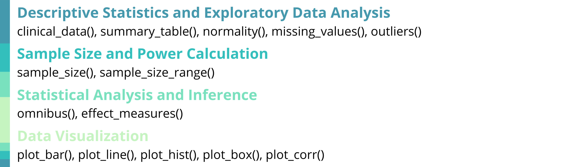
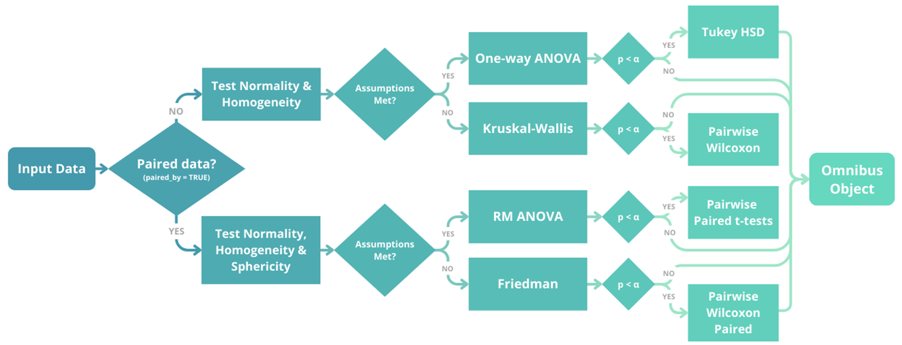

# Summary

_**biostats**_ is an R package [@R:2024] that provides a cohesive and
structured set of tools for biostatistics and clinical data analysis. The package 
includes 14 specialized functions covering descriptive statistics, exploratory 
data analysis, sample size and power calculations, statistical analysis and 
inference, and data visualization. These functions aim to offer standardized, 
well-documented workflows that are frequently required in clinical studies, 
trial planning, and analysis. By consolidating these capabilities into a single
framework, the package facilitates consistent, transparent, and reproducible 
analyses across studies.

This package serves both as an analytical toolkit for professional 
biostatisticians and clinical data analysts, and as an educational resource for 
researchers transitioning to R-based biostatistics, including professionals from
other domains, clinical researchers, and medical practitioners involved in the
development of clinical trials. 

_**biostats**_ is available on the Comprehensive R Archive Network (CRAN) and 
adheres to CRAN standards for documentation, testing, reproducibility, and 
long-term maintainability within the R ecosystem.

# Statement of need

Biostatistics is a fundamental component of clinical research, essential for 
validating trial designs, methodologies, results, conclusions, as well as 
supporting submission to regulatory entities [@Sagar:2023; @Ciolino:2021; 
@Dwivedi:2022]. In practice, clinical data analysis involves the execution of 
similar tasks across multiple studies and projects. Typical workflows include 
the calculation of descriptive statistics and exploratory data analysis, 
assumption validation, hypothesis testing, primary, secondary, and exploratory 
statistical analyses, effect size estimation, sample size and power 
calculations, as well as data visualization.

Popular packages in this field include Hmisc [@Hmisc:2026] and tableone 
[@tableone:2022] for descriptive statistics, pwr [@pwr:2020] for power and sample
size calculations, effectsize [@effectsize:2020] for effect size estimates, and ggplot2 
[@ggplot2:2016] for data visualization, among others. While these 
packages are well-designed and widely used, completing a clinical study workflow
typically requires combining multiple packages with different syntax conventions
, output formats, and integration patterns. As a result, analysts frequently 
develop custom code to connect results, automate recurring tasks, or standardize
outputs across studies. This fragmentation can lead to inconsistent 
implementations, duplicated effort, and increased time spent on code development,
validation, and quality control.

The _**biostats**_ package addresses these challenges by providing a unified, 
clinically oriented framework that consolidates commonly used biostatistical 
procedures into a single, coherent toolkit. While users still retain full 
flexibility to write custom code tailored to study-specific needs, _**biostats**_ is 
designed to streamline repetitive and foundational tasks in biostatistics and 
clinical data analysis through consistent syntax, harmonized outputs, and 
functions that reflect standard clinical workflows. Its goal is to deliver a 
professional-grade toolset for biostatisticians and clinical researchers while 
remaining accessible to data analysts from other fields. In addition, _**biostats**_ 
serves as an educational resource for users transitioning to R or to 
biostatistics, offering a structured and reproducible approach aligned with 
contemporary recommendations for transparent and rigorous statistical practice.

# State of the field

Regarding the specific functions in this package, _**biostats**_ differs from existing
packages such as ez [@ez:2016], rstatix [@rstatix:2023], ggblanket 
[@ggblanket:2025], ggpubr [@ggpubr:2025], extras [@extras:2025], 
SampleSize4ClinicalTrials [@SampleSize4ClinicalTrials:2021], TrialSize 
[@TrialSize:2024], TrialSimulator [@TrialSimulator:2025] and simtrial 
[@simtrial:2025] to name a few, due to its ease of use, consistent syntax, clear
and professional presentation of results without unnecessary complexity in 
interpretation, and thorough, beginner-friendly documentation.

The functions *sample_size()*, *sample_size_range()*, *effect_measures()* and 
*normality()* propose a composite approach to variable evaluation. In many 
existing packages these analyses are implemented through separate functions 
dependent on specific statistical tests or methods. For example, normality 
assessment via distinct tests (e.g. Shapiro–Wilk, Kolmogorov–Smirnov), kurtosis
measures, or independent graphical analyses; sample size calculations through 
functions tailored to individual study designs; and effect measures evaluated 
separately for each type of association. In contrast, the _**biostats**_ package 
unifies these analysis within single functions, providing a unified, consistent,
and streamlined workflow.

The *omnibus()* function offers an integrated approach to determining whether 
parametric linear models or non-parametric alternatives are appropriate. It 
evaluates data using minimally specified parameters, returns the corresponding 
model’s analysis, reports observed values per each assumption, runs appropriate 
post-hoc tests, and  presents the results in an clear and easy-to-follow format.  

The *missing_values()*, *outliers()*, and *summary_table()* functions present data and 
analysis in a clean and organized format with professional visual outputs, as 
opposed to other alternatives that only return raw values without formatting or 
graphical complements.

When compared to other available options, the *clinical_data()* function offers a 
simple but realistic and clean dataframe of simulated clinical data, ideal for 
users who want sample data without highly specialized parameters.

The ggplot2 wrapper functions included in this package are designed to require 
minimal code and parameter specifications, while quickly producing professional
publication-grade visualizations and fully retaining the flexibility to further 
customize ggplot2 objects.

# Software Design

The _**biostats**_ package was designed to balance analytical rigor, usability, and 
reproducibility in applied biostatistics and other analytical fields where these
tools could also be useful. The structure of the package follows a unified, 
workflow-oriented design, where each function performs a complete analytical 
step and returns clear, structured outputs that can be implemented as input for 
subsequent analysis with other functions. This approach prioritizes transparency
and auditability, enabling analyses to be inspected, reproduced, and reviewed in
a stepwise manner. To support chaining, reporting, and downstream reuse, 
parameters and outputs are standardized across functions.

Visualization functions return native ggplot2 objects rather than static 
figures. This design enables users to quickly produce professional, 
publication-grade visualizations with minimal code, while retaining full 
flexibility to customize aesthetics and formatting to meet specific reporting or
journal requirements without modifying internal package logic.

Overall, this package aims to emphasizes clarity, consistency, and 
reproducibility, supporting both analytical workflows and educational use by 
researchers and professionals transitioning to R-based biostatistics and 
clinical data analysis.

# Research Impact Statement

The _**biostats**_ package has been released on CRAN (current version: 1.1.1), 
ensuring standardized installation, long-term availability, and seamless 
integration within the R ecosystem. It is also publicly available and 
maintained on GitHub, where it is accompanied by reproducible examples, 
detailed documentation, and an active issue tracker. Updates have been 
implemented based on the authors’ real-world use, as well as user feedback, 
supporting transparency, reproducibility, and community-driven improvement.

Since its release, the software has demonstrated early but meaningful adoption 
within the biostatistics and broader data analysis communities, reflected by 
package downloads, GitHub stars, active engagement through comments, shares, 
and reactions across professional social media platforms. In addition, the 
authors have received positive feedback and feature suggestions from users 
across multiple disciplines, including data science, clinical research, 
healthcare, and applied statistics, indicating relevance beyond a single 
application domain. 

The package addresses a common challenge in applied research: the fragmentation 
of statistical workflows across multiple scripts and tools. By providing a 
unified set of functions for core biostatistical tasks, it promotes reproducible
and transparent analysis, as well as providing thorough documentation for 
educational purposes.

# Key features

## Descriptive Statistics and Exploratory Data Analysis

*clinical_data()* creates a simulated clinical trial dataset with subject 
demographics, multiple visits, treatment groups with different effects, 
numerical and categorical variables, as well as optional missing data and 
dropout rates. 

*summary_table()* performs descriptive statistics with normality assessment 
(Shapiro–Wilk or Kolmogorov–Smirnov with Lilliefors’ correction), selects 
appropriate tests such as Welch’s t-test or Mann–Whitney U for numerical 
variables and chi-squared or Fisher’s exact tests for categorical variables, and
computes effect sizes including Cohen’s d, Mann-Whitney U effect size (r), odds 
ratios, and Cramer’s V.

*missing_values()* visualizes missing data patterns, *outliers()* identifies extreme
values using Tukey's method with customizable thresholds, and *normality()* 
performs an assessment of distributions with Q-Q plots, histograms, and multiple
diagnostic tests based on the recommendations mentioned by @Mishra:2019 and 
methods by @Lilliefors:1967 and @Dallal:1986.

## Sample Size and Power Calculation

*sample_size()* and *sample_size_range()* are specifically focused on sample 
size calculation for clinical trials based on the equations in @Chow:2017,
supporting equality, equivalence, and non-inferiority/superiority 
hypothesis, with parallel or crossover designs, and evaluating outcomes 
specified in means or proportions.

## Statistical Analysis and Inference

*omnibus()* performs multi-group hypothesis testing to evaluate overall 
differences among three or more groups, with the theory behind this function 
being influenced by the works of @Blanca:2017 and @Field:2012. This function 
automatically conducts assumption diagnostics and selects the appropriate 
statistical test based on data characteristics. It supports both independent and
repeated-measures designs and applies one-way ANOVA, repeated-measures ANOVA, 
Kruskal–Wallis test, or Friedman test as appropriate. When significant effects 
are detected, *omnibus()* also performs post-hoc comparisons.

*effect_measures()* calculates effect measure indices commonly required in 
clinical research, including odds ratios, risk ratios, and number needed to 
treat or harm.

## Data Visualization

The plotting functions *plot_bar()*, *plot_line()*, *plot_box()*, *plot_hist()*, 
and *plot_corr()* generate publication-ready visualizations tailored for 
clinical research. These functions display summary measures such as means, 
medians, standard errors, standard deviations, and 95 percent confidence 
intervals, and they apply consistent formatting, grouping structures, and 
labeling to enhance interpretability. Each function returns a fully customizable
ggplot2 object, allowing users to refine themes, annotations, scales, and other 
graphical elements.

# License and Availability

The _**biostats**_ package is distributed under an MIT license with source code,
full documentation, and examples for all functions available on 
[GitHub](https://github.com/sebasquirarte/biostats). 

# Acknowledgements

The authors wish to acknowledge the R open-source community for their ongoing 
maintenance of the packages upon which _**biostats**_ depends, and for their continued
commitment to transparency and reproducibility in scientific research. Gratitude
is also extended to Laboratorios Sophia S.A. de C.V. for supporting the authors 
through salaries and employment, and for fostering an environment that promotes 
innovation, open-source development, and open science.

# AI usage disclosure

Generative AI tools were used during the development of the _**biostats**_ package 
to assist with code refinement, debugging, automated tests, and the 
configuration of continuous integration and continuous deployment (CI/CD) 
workflows through GitHub actions. These tools were also used to 
review and improve the final manuscript. All AI-generated suggestions were 
carefully reviewed, modified, and validated by the authors. The authors
assume full responsibility and accountability for the reliability, integrity, 
and maintenance of the software provided.  

# References
