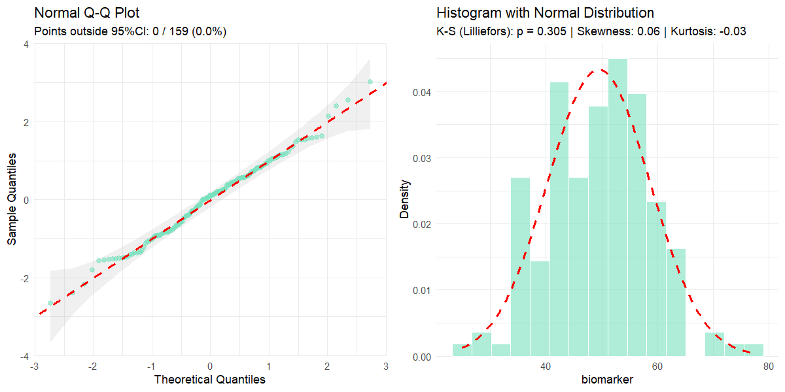
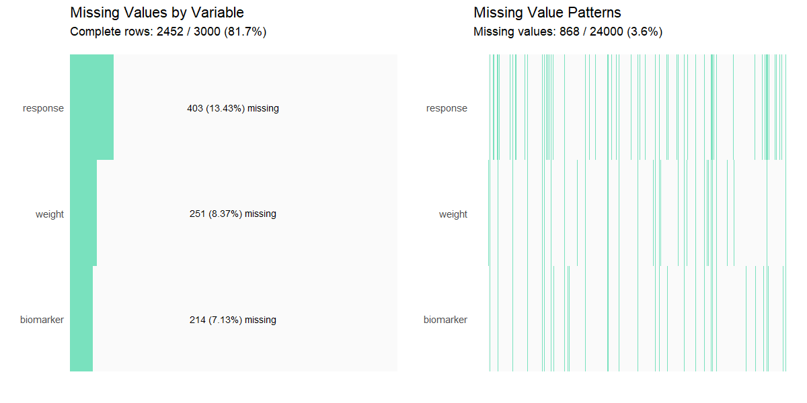
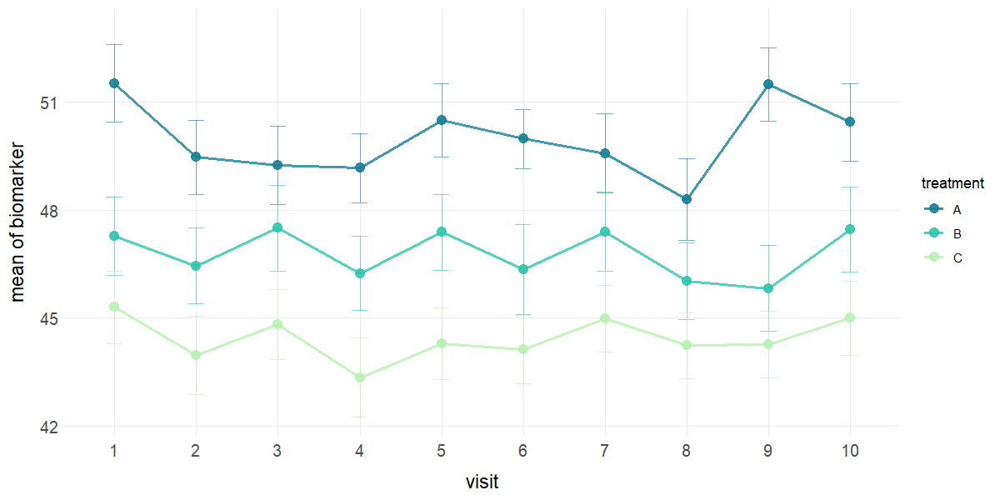

# Summary


_**biostats**_ is an R package [@R:2024] that provides a cohesive and
structured set of tools for biostatistics and clinical data analysis. The package 
includes 14 specialized functions covering descriptive statistics, exploratory 
data analysis, sample size and power calculations, statistical analysis and 
inference, and data visualization. These functions aim to offer standardized, 
well-documented workflows that are frequently required in clinical studies, 
trial planning, and analysis. By consolidating these capabilities into a single
framework, the package facilitates consistent, transparent, and reproducible 
analyses across studies.

This package serves both as an analytical toolkit for professional 
biostatisticians and clinical data analysts, and as an educational resource for 
researchers transitioning to R-based biostatistics, including professionals from
other domains, clinical researchers, and medical practitioners involved in the
development of clinical trials. 

_**biostats**_ is available on the Comprehensive R Archive Network (CRAN) and 
adheres to CRAN standards for documentation, testing, reproducibility, and 
long-term maintainability within the R ecosystem.


# Statement of need

Biostatistics is a fundamental component of clinical research, essential for 
validating trial designs, methodologies, results, conclusions, as well as 
supporting submission to regulatory entities [@Sagar:2023; @Ciolino:2021; 
@Dwivedi:2022]. In practice, clinical data analysis involves the execution of 
similar tasks across multiple studies and projects. Typical workflows include 
the calculation of descriptive statistics and exploratory data analysis, 
assumption validation, hypothesis testing, primary, secondary, and exploratory 
statistical analyses, effect size estimation, as wellas sample size and power 
calculations.

Popular packages in this field include Hmisc [@Hmisc:2026] and tableone 
[@tableone:2022] for descriptive statistics, pwr 
(Champely S., 2020) for power and sample size calculations, effectsize 
(Ben-Shachar M. et al., 2020) for effect size estimates, and ggplot2 
(Wickham H. et al, 2016) for data visualization, among others. While these 
packages are well-designed and widely used, completing a clinical study workflow
typically requires combining multiple packages with different syntax conventions
, output formats, and integration patterns. As a result, analysts frequently 
develop custom code to connect results, automate recurring tasks, or standardize
outputs across studies. This fragmentation can lead to inconsistent 
implementations, duplicated effort, and increased time spent on code development
, validation, and quality control.

The biostats package addresses these challenges by providing a unified, 
clinically oriented framework that consolidates commonly used biostatistical 
procedures into a single, coherent toolkit. While users still retain full 
flexibility to write custom code tailored to study-specific needs, biostats is 
designed to streamline repetitive and foundational tasks in biostatistics and 
clinical data analysis through consistent syntax, harmonized outputs, and 
functions that reflect standard clinical workflows. Its goal is to deliver a 
professional-grade toolset for biostatisticians and clinical researchers while 
remaining accessible to data analysts from other fields. In addition, biostats 
serves as an educational resource for users transitioning to R or to 
biostatistics, offering a structured and reproducible approach aligned with 
contemporary recommendations for transparent and rigorous statistical practice.

# State of the field

Regarding the specific functions in this package, biostats differs from existing
packages such as ez (Lawrence, M. A., 2016), rstatix (Kassambara, A., 2025), 
ggblanket (Hodge, D., 2025), ggpubr (Kassambara, A., 2025), extras (Hill, N. et 
al, 2025), SampleSize4ClinicalTrials (Qi, H., Zhu, F., 2021), TrialSize (Zhang, 
E. et al, 2024), TrialSimulator (Zhang, H., 2025) and simtrial (Anderson, K., et
al, 2025) to name a few, due to its ease of use, consistent syntax, clear and 
professional presentation of results without unnecessary complexity in 
interpretation, and thorough, beginner-friendly documentation.

The functions sample_size(), sample_size_range(), effect_measures() and 
normality() propose a composite approach to variable evaluation. In many 
existing packages these analyses are implemented through separate functions 
depending on specific statistical tests or methods. For example, normality 
assessment via distinct tests (e.g., Shapiro–Wilk, Kolmogorov–Smirnov), kurtosis
measures, or independent graphical analyses, sample size calculations through 
functions tailored to individual study designs, and effect measures evaluated 
separately for each type of association. In contrast, the biostats package 
unifies these analysis within single functions, providing a unified, consistent,
and streamlined workflow.

The omnibus() function offers an integrated approach to determining whether 
parametric linear models or non-parametric alternatives are appropriate. It 
evaluates data using minimally specified parameters, returns the corresponding 
model’s analysis, reports observed values per each assumption, runs appropriate 
post-hoc tests, and  presents the results in an clear and easy-to-follow format.  
The missing_values(), outliers() and summary_table() functions present data and 
analysis in a clean and organized format with professional visual outputs, as 
opposed to other alternatives that only return raw values without formatting or 
graphical complements.

When compared to other available options, the clinical_data() function offers a 
simple but realistic and clean dataframe of simulated clinical data, ideal for 
users who want sample data without highly specialized parameters.

The ggplot2 wrapper functions included in this package are designed to require 
minimal code and parameter specifications, while quickly producing professional
publication-grade visualizations and fully retaining the flexibility to further 
customize ggplot2 objects.

# Software Design

The biostats package was designed to balance analytical rigor, usability, and 
reproducibility in applied biostatistics and other analytical fields where these
tools could also be useful. The structure of the package follows a unified, 
workflow-oriented design, where each function performs a complete analytical 
step and returns clear, structured outputs that can be implemented as input for 
subsequent analysis with other functions. This approach prioritizes transparency
and auditability, enabling analyses to be inspected, reproduced, and reviewed in
a stepwise manner. To support chaining, reporting, and downstream reuse, 
parameters and outputs are standardized across functions.

Visualization functions return native ggplot2 objects rather than static 
figures. This design enables users to quickly produce professional, 
publication-grade visualizations with minimal code, while retaining full 
flexibility to customize aesthetics and formatting to meet specific reporting or
journal requirements without modifying internal package logic.

Overall, the package aims to emphasizes clarity, consistency, and 
reproducibility, supporting both analytical workflows and educational use by 
researchers and professionals transitioning to R-based biostatistics and 
clinical data analysis.

# Research Impact Statement

The biostats package has been released on CRAN (current version: 1.1.1), 
ensuring standardized installation, long-term availability, and seamless 
integration within the R ecosystem. It is also publicly available and 
maintained on GitHub, where it is accompanied by reproducible examples, 
detailed documentation, and an active issue tracker. Updates have been 
implemented based on the authors’ real-world use, as well as user feedback, 
supporting transparency, reproducibility, and community-driven improvement.

Since its release, the software has demonstrated early but meaningful adoption 
within the biostatistics and broader data analysis communities, reflected by 
package downloads, GitHub stars, active engagement through comments, shares, 
and reactions across professional social media platforms. In addition, the 
authors have received positive feedback and feature suggestions from users 
across multiple disciplines, including data science, clinical research, 
healthcare, and applied statistics, indicating relevance beyond a single 
application domain. 

The package addresses a common challenge in applied research: the fragmentation 
of statistical workflows across multiple scripts and tools. By providing a 
unified set of functions for core biostatistical tasks, it promotes reproducible
and transparent analysis, as well as providing thorough documentation for 
educational purposes.

# Key features

## Descriptive Statistics and Exploratory Data Analysis

*clinical_data()* creates a simulated clinical trial dataset with subject 
demographics, multiple visits, treatment groups with different effects, 
numerical and categorical variables, as well as optional missing data and 
dropout rates. 

*summary_table()* performs descriptive statistics with normality assessment 
(Shapiro–Wilk or Kolmogorov–Smirnov with Lilliefors’ correction), selects 
appropriate tests such as Welch’s t-test or Mann–Whitney U for numerical 
variables and chi-squared or Fisher’s exact tests for categorical variables, and
computes effect sizes including Cohen’s d, Mann-Whitney U effect size (r), odds 
ratios, and Cramer’s V.

*missing_values()* visualizes missing data patterns, outliers() identifies extreme
values using Tukey's method with customizable thresholds, and normality() 
performs an assessment of distributions with Q-Q plots, histograms, and multiple
diagnostic tests based on the recommendations mentioned by Mishra P. et al 
(2019) and methods by Lilliefors, H.W. (1967) and Dallal, G.E. & Wilkinson, L. 
(1986).

## Sample Size and Power Calculation

*sample_size()* and *sample_size_range()* are specifically focused on sample 
size calculation for clinical trials based on the equations in Chow et al. 
(2017), supporting equality, equivalence, and non-inferiority/superiority 
hypothesis, with parallel or crossover designs, and evaluating outcomes 
specified in means or proportions.

## Statistical Analysis and Inference

*omnibus()* performs multi-group hypothesis testing to evaluate overall 
differences among three or more groups, with the theory behind this function 
being influenced by the works of Blanca M. et al. (2017) and Field A. (2012). 
This function automatically conducts assumption diagnostics and selects the 
appropriate statistical test based on data characteristics. It supports both 
independent and repeated-measures designs and applies one-way ANOVA, 
repeated-measures ANOVA, Kruskal–Wallis test, or Friedman test as appropriate. 
When significant effects are detected, omnibus() also performs post-hoc 
comparisons.


*effect_measures()* calculates effect measure indices commonly required in 
clinical research, including odds ratios, risk ratios, and number needed to 
treat or harm.

## Data Visualization

The plotting functions *plot_bar()*, *plot_line()*, *plot_box()*, *plot_hist()*, 
and *plot_corr()* generate publication-ready ggplot2 visualizations tailored for 
clinical research. These functions can compute and display optional summary 
measures such as means, medians, standard errors, standard deviations, and 95 
percent confidence intervals, and they apply consistent formatting, grouping 
structures, and labeling to enhance interpretability. Each function returns a 
fully customizable ggplot2 object, allowing users to refine themes, annotations, 
scales, and other graphical elements.

# Examples

``` r
# Simulate basic clinical data
clinical_df <- clinical_data()

head(clinical_df, 10)
#>    participant_id visit  sex treatment age weight biomarker response
#> 1             001     1 Male Treatment  35   55.4     42.22 Complete
#> 2             001     2 Male Treatment  35   60.3     44.70     None
#> 3             001     3 Male Treatment  35   58.1     44.85  Partial
#> 4             002     1 Male   Placebo  21   68.3     56.51     None
#> 5             002     2 Male   Placebo  21   66.3     51.03     None
#> 6             002     3 Male   Placebo  21   64.0     39.59     None
#> 7             003     1 Male   Placebo  47   76.0     24.92     None
#> 8             003     2 Male   Placebo  47   77.6     49.99  Partial
#> 9             003     3 Male   Placebo  47   74.9     60.69     None
#> 10            004     1 Male   Placebo  35   61.7     50.58     None
```

``` r
# Grouped summary by treatment group with all stats and effect size
summary_table(clinical_df,
              group_by = 'treatment',
              all = TRUE,
              effect_size = TRUE,
              exclude = c('participant_id', 'visit'))
```


``` r
# Filter clinical data to Placebo arm
clinical_df_treat <- clinical_df[clinical_df$treatment == "Placebo", ]

# Normally distributed variable
normality(data = clinical_df_treat, "biomarker")
#> 
#> Normality Test for 'biomarker' 
#> 
#> n = 159 
#> mean (SD) = 49.44 (9.2) 
#> median (IQR) = 50.38 (13.1) 
#> 
#> Kolmogorov-Smirnov (Lilliefors): D = 0.054, p = 0.305 
#> Shapiro-Wilk: W = 0.992, p = 0.546 
#> Skewness: 0.06 (z = 0.30) 
#> Kurtosis: -0.03 (z = -0.08) 
#> 
#> Data appears normally distributed.
```



``` r
# Missing value analysis of only variables with missing values
missing_values(clinical_df_full)
#> 
#> Missing Value Analysis
#> 
#> Complete rows: 2452 (81.7%)
#> Missing cells: 868 (3.6%)
#> 
#>           n_missing pct_missing
#> response        403       13.43
#> weight          251        8.37
#> biomarker       214        7.13
```



``` r
# Basic outlier detection
outliers(clinical_df_full, "biomarker")
#> 
#> Outlier Analysis
#> 
#> Variable: 'biomarker'
#> n: 2786
#> Missing: 214 (7.1%)
#> Method: Tukey's IQR x 1.5
#> Bounds: [18.971, 74.761]
#> Outliers detected: 19 (0.7%)
#> 
#> Outlier indices: 27, 223, 440, 559, 795, 931, 973, 1175, 1277, 1346 (...)
```


``` r
# Two-sample parallel non-inferiority test for means with 10% expected dropout
sample_size(sample = 'two-sample', design = 'parallel', outcome = 'mean',
            type = 'non-inferiority', x1 = 5.0, x2 = 5.0, 
            SD = 0.1, delta = -0.05, k = 1, dropout = 0.1)
#> 
#> Sample Size Calculation
#> 
#> Test type: non-inferiority
#> Design: parallel, two-sample
#> Outcome: mean
#> Alpha (α): 0.050
#> Beta (β): 0.200
#> Power: 80.0%
#> 
#> Parameters:
#> x1 (treatment): 5.000
#> x2 (control/reference): 5.000
#> Difference (x1 - x2): 0.000
#> Standard Deviation (σ): 0.100
#> Allocation Ratio (k): 1.00
#> Delta (δ): -0.050
#> Dropout rate: 10.0%
#> 
#> Required Sample Size
#> n1 = 55
#> n2 = 55
#> Total = 110
#> 
#> Note: Sample size increased by 10.0% to account for potential dropouts.
```

``` r
# Compare numerical variable across treatments
omnibus(data = clinical_df_full, y = "biomarker", x = "treatment")
#> 
#> Omnibus Test: One-way ANOVA
#> 
#> Assumption Testing Results:
#> 
#>   Normality (Shapiro-Wilk Test):
#>   A: W = 0.9980, p = 0.321
#>   B: W = 0.9975, p = 0.237
#>   C: W = 0.9988, p = 0.733
#>   Overall result: Normal distribution assumed.
#> 
#>   Homogeneity of Variance (Bartlett Test):
#>   Chi-squared(2) = 1.3685, p = 0.504
#>   Effect size (Cramer's V) = 0.0151
#>   Result: Homogeneous variances.
#> 
#> Test Results:
#>   Formula: biomarker ~ treatment
#>   alpha: 0.05
#>   Result: significant (p = <0.001)
#> 
#> Post-hoc Multiple Comparisons
#> 
#>   Tukey Honest Significant Differences (alpha: 0.050):
#>   Comparison               Diff    Lower    Upper    p-adj
#>   --------------------------------------------------------- 
#>   B - A                  -3.178   -4.296   -2.060   <0.001*
#>   C - A                  -5.542   -6.618   -4.466   <0.001*
#>   C - B                  -2.364   -3.468   -1.259   <0.001*
#> 
#> The study groups show a moderately imbalanced distribution 
#> of sample sizes (Δn = 0.214).
``` 

``` r
effect_measures(exposed_event = 15, 
                exposed_no_event = 85,
                unexposed_event = 5,
                unexposed_no_event = 95)
#> 
#> Odds/Risk Ratio Analysis
#> 
#> Contingency Table:
#>                 Event No Event      Sum
#> Exposed            15       85      100
#> Unexposed           5       95      100
#> Sum                20      180      200
#> 
#> Odds Ratio: 3.353 (95% CI: 1.169 - 9.616)
#> Risk Ratio: 3.000 (95% CI: 1.133 - 7.941)
#> 
#> Risk in exposed: 15.0%
#> Risk in unexposed: 5.0%
#> Absolute risk difference: 10.0%
#> Number needed to harm (NNH): 10.0
#> 
#> Note: Correction not applied (no zero values).
```

``` r
# Grouped barplot of categorical variable by treatment with value labels
plot_bar(data = clinical_df, x = "response", 
         group = "visit", facet = "treatment", 
         title = "Response by visit and treatment", values = TRUE)
```


``` r
# Line plot with mean and standard error by treatment
plot_line(data = clinical_df_full, x = "visit", y = "biomarker",
          group = "treatment", stat = "mean", error = "se")
```



``` r
# Faceted histogram
plot_hist(clinical_df, x = "biomarker", facet = "treatment")
```


``` r
# Boxplot of biomarker by study visit and treatment
plot_box(clinical_df, x = "visit", y = "biomarker", group = "treatment")
```


``` r
# Lower triangle with significance indicators and filtering for R dataset 'swiss'
plot_corr(data = swiss, type = "lower", show_sig = TRUE, sig_only = TRUE)
```


# AI usage disclosure

Generative AI tools were used during the development of the biostats R package 
to assist with code refinement, debugging, automated tests, and the 
configuration of continuous integration and continuous deployment (CI/CD) 
workflows within GitHub through GitHub actions. These tools were also used to 
review and improve the final manuscript. All AI-generated suggestions were 
carefully reviewed, modified, and validated manually by the authors. The authors
assume full responsibility and accountability for the reliability, integrity, 
and maintenance of the software provided.  

# Citations

Citations to entries in paper.bib should be in
[rMarkdown](http://rmarkdown.rstudio.com/authoring_bibliographies_and_citations.html)
format.

If you want to cite a software repository URL (e.g. something on GitHub without a preferred
citation) then you can do it with the example BibTeX entry below for @fidgit.

For a quick reference, the following citation commands can be used:
- `@author:2001`  ->  "Author et al. (2001)"
- `[@author:2001]` -> "(Author et al., 2001)"
- `[@author1:2001; @author2:2001]` -> "(Author1 et a l., 2001; Author2 et al., 2002)"

# Figures

Figures can be included like this:

and referenced from text using \autoref{fig:example}.

Figure sizes can be customized by adding an optional second parameter:
{ width=20% }

# License and Availability

The biostats package is distributed under an MIT license, with all source code 
available through [GitHub](https://github.com/sebasquirarte/biostats). 

# Acknowledgements

The authors wish to acknowledge the R open-source community for their ongoing 
maintenance of the packages upon which biostats depends, and for their continued
commitment to transparency and reproducibility in scientific research. Gratitude
is also extended to Laboratorios Sophia S.A. de C.V. for supporting the authors 
through salaries and employment, and for fostering an environment that promotes 
innovation, open-source development, and open science.

# References
